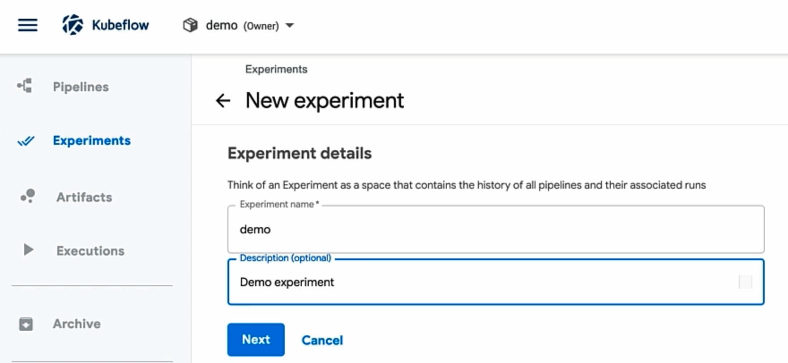
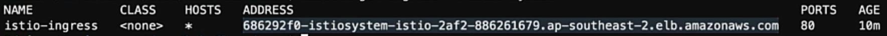

# Build an end-to-end Machine Learning Platform using Kubeflow on Amazon EKS
------------

 Kubeflow is dedicated to making ML deployments on Kubernetes simple, portable, and scalable. In this lab, get hands on with learning how you can leverage Kubeflow on Amazon EKS to deploy best-of-breed open source machine learning systems to provide all the tools you need to run machine learning in the cloud. Leveraging Kubeflow on Amazon EKS you will dive into notebooks, model training, autoML, workflows, and model serving.

## Index 
- [Preparing the Environment](#preparing-the-environment)
- [Configuring Kubeflow](#configuring-kubeflow)
- [Deploy Kubeflow](#deploy-kubeflow)
- [Kubeflow Dashboard](#kubeflow-dashboard)
- [Kubeflow Notebooks](#kubeflow-notebooks)
- [Model Training](#model-training)
- [Model Inference](#model-inference)
- [Katib](#katib)
- [Kubeflow Pipelines](#kubeflow-pipelines)
- [Survey](#survey)

---

## Preparing the Environment
---
You can run this lab on your local system, for the lab instructions we're using a cloud 9 environment where we have setup aws cli, eksctl, and aws-iam-authenticator. We have an existing EKS cluster, for this demo we're running 6 m5.large nodes.

To start we're going to set up a couple of environment variables, first the desired name for our cluster

```shell
export AWS_CLUSTER_NAME=kubeflow-demo
```
Then the region we want to run the cluster in, for this demo I'll be running in the Sydney region
```shell
export AWS_REGION=ap-southeast-2
```

We can now move onto installing kfctl and adding some additional environment variables

First we will download the kfctl v1.2.0 release from the kubeflow releases page on github and extract it to our tmp directory
```shell
curl --silent --location https://github.com/kubeflow/kfctl/releases/download/v1.2.0/kfctl_v1.2.0-0-gbc038f9_linux.tar.gz | tar xz -C /tmp
```
Then we move our extracted kfctl file to /usr/local/bin to make it easier to use
```shell
sudo mv -v /tmp/kfctl /usr/local/bin
```

Next we're going to set an environment variable for the default configuration file for authentication which leverages dex a federated openid connect provider. The kubeflow repository also contains a configuration file for enabling multi user auth using AWS cognito as well. But for this demo we are going to use the default configuration file 
```shell
export CONFIG_URI="https://raw.githubusercontent.com/kubeflow/manifests/v1.2-branch/kfdef/kfctl_aws.v1.2.0.yaml"
```


Finally we're going to create a deployment directory for the cluster, change the directory to the new folder, and then download the kfctl configuration file
```shell
mkdir ${AWS_CLUSTER_NAME} && cd ${AWS_CLUSTER_NAME}
```
```shell
wget -O kfctl_aws.yaml $CONFIG_URI
```


## Configuring Kubeflow
---
Now we can make a couple changes to our configuration before we deploy kubeflow. The first configuration item that should be changed is the default username and password.

```shell
vim kfctl_aws.yaml
```


Besides the username and password the only other value we need to update in the configuration file for this demo is the aws region, making sure it matches the one we defined in our environment variables

> Kubeflow supports the use of AWS IAM roles for service accounts and this is the default and recommended approach. kfctl will create or reuse the clusters IAM OIDC Identity Provider, it will then create any necessary IAM roles, and finally configure the trust relationship binding the kubernetes service accounts with the newly created roles.

## Deploy Kubeflow
---
Now we can deploy kubeflow to our cluster
First we run the command to initialise the kubeflow cluster

```shell
kfctl apply -V -f kfctl_aws.yaml
```
You may see a couple error messages pop up as we're waiting for all services to be ready.

Then we just need to wait for all resources to become ready
```shell
kubectl -n kubeflow get all
```
Installing Kubeflow and its toolset can take around 2-3 minutes. A few pods may show a CrashLoopBackOff status, but given time they will auto-heal and come to a running state.

## Kubeflow Dashboard
---
We can use port-forward to setup access to the Kubeflow Dashboard.
```shell
kubectl port-forward svc/istio-ingressgateway -n istio-system 8080:80
```

In our cloud9 environment we can click on **tools > preview > preview running application** to access the dashboard. 


You can click on the popout button to maximize our dashboard into a new tab. Leave the current terminal process running, if you kill it you will lose access to the dashboard.


We use the email/password that we set in the configuration file.

Now we need to run through the setup to create a namespace for our account.
Click on **Start Setup**


For our demo lets specify the namespace as **demo** and then click finish.


We've now setup kubeflow and have access to our kubeflow dashboard.


## Kubeflow Notebooks
---
Jupyter notebook is an open-source web application that allows you to create and share documents that contain live code, equations, visualizations and narrative text. They are often used for data cleaning and transformation, numerical simulation, statistical modeling, data visualization, machine learning, and more.

On the Kubeflow Dashboard under **Quick Shortcuts** click on **Create a new Notebook Server**


Make sure that you're in the correct namespace by checking the current namespace on the top bar as this prepopulates the namespace field on the form.


Lets specify a name for our notebook server, I'm calling this one **myjupyter**

Next we make sure we have the right image selected, we want the latest **tensorflow-1.x** image which name ends in **cpu**

Then we're going to bump up our CPU value to **1.0** to give it a little bit more grunt power.


Scroll to the bottom, take all other defaults, and click on **LAUNCH**.


It takes a few seconds for the Jupyter notebook to come online. Once it's status shows a green tick we can then click on **CONNECT**


This connects to the Jupyter Notebook server we just created.

We can create a new notebook by selecting the **Python 3** option under **Notebook**, this creates an empty Python3 jupyter notebook.


So now we can copy in some sample training code and paste it into our first code block, this sample code is available from the eksworkshop. This sample code uses tensorflow to create a training model for MNIST database.

https://github.com/aws-samples/eks-workshop/blob/main/content/advanced/420_kubeflow/kubeflow.files/mnist-tensorflow-jupyter.py

```Python
from __future__ import print_function

import tensorflow as tf
from tensorflow import keras

# Helper libraries
import numpy as np
import os
import subprocess
import argparse

# Reduce spam logs from s3 client
os.environ['TF_CPP_MIN_LOG_LEVEL']='3'

def preprocessing():
  fashion_mnist = keras.datasets.fashion_mnist
  (train_images, train_labels), (test_images, test_labels) = fashion_mnist.load_data()

  # scale the values to 0.0 to 1.0
  train_images = train_images / 255.0
  test_images = test_images / 255.0

  # reshape for feeding into the model
  train_images = train_images.reshape(train_images.shape[0], 28, 28, 1)
  test_images = test_images.reshape(test_images.shape[0], 28, 28, 1)

  class_names = ['T-shirt/top', 'Trouser', 'Pullover', 'Dress', 'Coat',
                'Sandal', 'Shirt', 'Sneaker', 'Bag', 'Ankle boot']

  print('\ntrain_images.shape: {}, of {}'.format(train_images.shape, train_images.dtype))
  print('test_images.shape: {}, of {}'.format(test_images.shape, test_images.dtype))

  return train_images, train_labels, test_images, test_labels

def train(train_images, train_labels, epochs, model_summary_path):
  if model_summary_path:
    logdir=model_summary_path # + datetime.now().strftime("%Y%m%d-%H%M%S")
    tensorboard_callback = keras.callbacks.TensorBoard(log_dir=logdir)

  model = keras.Sequential([
    keras.layers.Conv2D(input_shape=(28,28,1), filters=8, kernel_size=3,
                        strides=2, activation='relu', name='Conv1'),
    keras.layers.Flatten(),
    keras.layers.Dense(10, activation=tf.nn.softmax, name='Softmax')
  ])
  model.summary()

  model.compile(optimizer=tf.train.AdamOptimizer(),
                loss='sparse_categorical_crossentropy',
                metrics=['accuracy']
                )
  if model_summary_path:
    model.fit(train_images, train_labels, epochs=epochs, callbacks=[tensorboard_callback])
  else:
    model.fit(train_images, train_labels, epochs=epochs)

  return model

def eval(model, test_images, test_labels):
  test_loss, test_acc = model.evaluate(test_images, test_labels)
  print('\nTest accuracy: {}'.format(test_acc))

def export_model(model, model_export_path):
  version = 1
  export_path = os.path.join(model_export_path, str(version))

  tf.saved_model.simple_save(
    keras.backend.get_session(),
    export_path,
    inputs={'input_image': model.input},
    outputs={t.name:t for t in model.outputs})

  print('\nSaved model: {}'.format(export_path))


def main(argv=None):
  parser = argparse.ArgumentParser(description='Fashion MNIST Tensorflow Example')
  parser.add_argument('--model_export_path', type=str, help='Model export path')
  parser.add_argument('--model_summary_path', type=str,  help='Model summry files for Tensorboard visualization')
  parser.add_argument('--epochs', type=int, default=5, help='Training epochs')
  args = parser.parse_args(args=[])

  train_images, train_labels, test_images, test_labels = preprocessing()
  model = train(train_images, train_labels, args.epochs, args.model_summary_path)
  eval(model, test_images, test_labels)

  if args.model_export_path:
    export_model(model, args.model_export_path)
```

Click on **Run** to load the code in the notebook. This will create a new empty codeblock for us. In the new codeblock we can call the **main()** function that was defined in the above codeblock. We can then run this codeblock to start the model training, you will see the output below the codeblock. The first few lines shows that TensorFlow and Keras dataset is downloaded. Training data set is 60k images and test data set is 10k images. Hyperparameters used for the training, outputs from five epochs, and finally the model accuracy is shown.


So it's that easy to get started with Jupyter Notebooks using Kubeflow.
## Model Training
---
While Jupyter Notebook is good for interactive model training, you may like to package the training code as a Docker image and run it in your Amazon EKS cluster.

For this portion of the lab we're going to build a training model for the Fashion-MNIST dataset using TensorFlow and Keras on Amazon EKS. This dataset contains 70k grayscale images in 10 categories and is meant to be a drop-in replacement for MNIST.

We will use a pre-built Docker image for this exercise, this image uses the **tensorflow1.13.1** image as it's base. The image has training code and downloads training and test data sets. It also stores the generated model in an S3 bucket.

First we will need to create the S3 bucket to save the training model, we generate a unique hash to append to our bucket name to make sure our bucket is globally unique
```shell
export HASH=$(< /dev/urandom tr -dc a-z0-9 | head -c6)
```

```shell
export S3_BUCKET=$HASH-eks-ml-data
```

And then create the bucket
```shell
aws s3 mb s3://$S3_BUCKET --region $AWS_REGION
```

We've exported the bucket name as an environment variable as it will be used in the pod specification. We will also use this bucket for serving the model.

We then need to create AWS credentials in the EKS cluster to allow the model to be saved to the S3 bucket.

We create an IAM user **s3user**
```shell
aws iam create-user --user-name s3-user
```
Attach the s3 access policy
```shell
aws iam attach-user-policy --user-name s3-user --policy-arn arn:aws:iam::aws:policy/AmazonS3FullAccess
```
 and retrieve temporary credentials
```shell
aws iam create-access-key --user-name s3-user > /tmp/create_output.json
```

We then need to load these credentials into environment variables
```shell
export AWS_ACCESS_KEY_ID_VALUE=$(jq -j .AccessKey.AccessKeyId /tmp/create_output.json | base64)
```

```shell
export AWS_SECRET_ACCESS_KEY_VALUE=$(jq -j .AccessKey.SecretAccessKey /tmp/create_output.json | base64)
```

And then apply them to the EKS cluster
```shell
cat <<EOF | kubectl apply -f -
apiVersion: v1
kind: Secret
metadata:
  name: aws-secret
type: Opaque
data:
  AWS_ACCESS_KEY_ID: $AWS_ACCESS_KEY_ID_VALUE
  AWS_SECRET_ACCESS_KEY: $AWS_SECRET_ACCESS_KEY_VALUE
EOF
```

We can now create our training pod, we're using the pod definition from the eksworkshop.
```shell
curl -LO https://eksworkshop.com/advanced/420_kubeflow/kubeflow.files/mnist-training.yaml
```

If we look at the pod definition we can see it's using the base image we spoke about earlier, it's also passing in the environment variables from the kubernetes secret.
```shell
cat mnist-training.yaml
```


We then create the pod
```shell
envsubst < mnist-training.yaml | kubectl create -f -
```

This will start a pod which starts training and saves the generated model in the S3 bucket. We can check the status of the pod
```shell
kubectl get pods
```


and we can also follow the logs to view our model training progress
```shell
kubectl logs mnist-training -f
```


Once the training is done the last line shows the model being saves to our S3 bucket.
## Model Inference
---
So we've trained our model and now we can use it for inference.

We can use the inference pod definition from the eksworkshop
```shell
curl -LO https://eksworkshop.com/advanced/420_kubeflow/kubeflow.files/mnist-inference.yaml
```

If we look at the pod definition we can see that it's referencing our tensorflow model that we have saved in our S3 bucket
```shell
cat mnist-inference.yaml
```


We can then create our container
```shell
envsubst <mnist-inference.yaml | kubectl apply -f -
```
and check to make sure it is in a running state
```shell
kubectl get pods
```
We can use port-forwarding for the inference endpoint to allow us to do some testing, ina new terminal we're going to port forward 8500 to our inference pod
```shell
kubectl port-forward `kubectl get pods -l=app=mnist,type=inference -o jsonpath='{.items[0].metadata.name}' --field-selector=status.phase=Running` 8500:8500
```

Back in our original terminal we're going to intall the tensorflow package, first we need pip to be able to install tensorflow, we'll use a bootstrap script.
```shell
curl -O https://bootstrap.pypa.io/get-pip.py
```
Then run the script
```shell
python3 get-pip.py --user
```
And finally we can then install tensorflow
```shell
pip3 install requests tensorflow --user
```

Now we can run inference to make prediction requests. We will use the inference script from the eksworkshop. The script will randomly pick an image from the test dataset and use it to make a prediction.
```shell
curl -LO https://eksworkshop.com/advanced/420_kubeflow/kubeflow.files/inference_client.py
```
Then run the script, pointing at our local endpoint
```shell
python inference_client.py --endpoint http://localhost:8500/v1/models/mnist:predict
```
 We can see here that our model has made a prediction on what it believed the image was of.

 
 
 Now we've seen how to run training jobs and inference, lets terminate these pods to free up resources
 
 ```shell
 kubectl delete -f mnist-training.yaml
 ```

```shell
kubectl delete -f mnist-inference.yaml 
```

## Katib
---
Katib is an open source kubernetes native project for automated machine learning (AutoML). Katib supports hyperparameter tuning, early stopping, and neural architecture search (NAS). We're going to be using Katib as a component of Kubeflow in this demo.

First we navigate to Katib from the sidebar. 


Here we decide which type of experiment we want to define. For this demo we're going to choose **Hyperparameter Tuning**.


We're now presented with a window were we can paste a yaml file or setup the experiment through the parameters form.

https://github.com/kubeflow/katib/blob/master/examples/v1beta1/hp-tuning/random.yaml
```yaml
apiVersion: kubeflow.org/v1beta1
kind: Experiment
metadata:
  namespace: kubeflow
  name: random
spec:
  objective:
    type: maximize
    goal: 0.99
    objectiveMetricName: Validation-accuracy
    additionalMetricNames:
      - Train-accuracy
  algorithm:
    algorithmName: random
  parallelTrialCount: 3
  maxTrialCount: 12
  maxFailedTrialCount: 3
  parameters:
    - name: lr
      parameterType: double
      feasibleSpace:
        min: "0.01"
        max: "0.03"
    - name: num-layers
      parameterType: int
      feasibleSpace:
        min: "2"
        max: "5"
    - name: optimizer
      parameterType: categorical
      feasibleSpace:
        list:
          - sgd
          - adam
          - ftrl
  trialTemplate:
    primaryContainerName: training-container
    trialParameters:
      - name: learningRate
        description: Learning rate for the training model
        reference: lr
      - name: numberLayers
        description: Number of training model layers
        reference: num-layers
      - name: optimizer
        description: Training model optimizer (sdg, adam or ftrl)
        reference: optimizer
    trialSpec:
      apiVersion: batch/v1
      kind: Job
      spec:
        template:
          spec:
            containers:
              - name: training-container
                image: docker.io/kubeflowkatib/mxnet-mnist:latest
                command:
                  - "python3"
                  - "/opt/mxnet-mnist/mnist.py"
                  - "--batch-size=64"
                  - "--lr=${trialParameters.learningRate}"
                  - "--num-layers=${trialParameters.numberLayers}"
                  - "--optimizer=${trialParameters.optimizer}"
            restartPolicy: Never
```


Katib's experiments don't work with Istio sidecar injection, so we need to make sure when we define the experiment that we annotate is to disable sidecar injection
			
```yaml
apiVersion: batch/v1
kind: Job
spec:
  template:
    ####################################
    metadata:
      annotations:
        sidecar.istio.io/inject: "false"
    ####################################
    spec:
      containers:
        - name: training-container
          image: docker.io/kubeflowkatib/mxnet-mnist:v1beta1-a96ff59
          command:
            - "python3"
            - "/opt/mxnet-mnist/mnist.py"
            - "--batch-size=64"
            - "--lr=${trialParameters.learningRate}"
            - "--num-layers=${trialParameters.numberLayers}"
            - "--optimizer=${trialParameters.optimizer}"
      restartPolicy: Never

```


Once we've created the experiment we can monitor it's progress. From the katib sidebar select **HP** > **Monitor**


We can now see our currently running experiments. Click into our newly created experiment, when the individual trials for the experiment finish they will begin to populate our graph with their results. We can also view the table below for details on each individual trial. When all trials have entered a **Succeeded** the experiment is complete, it will also show as a tick on the experiments dashboard. From our graph and table we can see that the **sgd** optimizer was by far the best of the three tested.


## Kubeflow Pipelines
---
From our homescreen, we can click **pipelines** on the sidebar, this takes us to the kubeflow pipelines interface. You can see here that there are a couple of tutorial and demo pipelines created by default. 


If we go into the DSL control structures pipeline we can see all the individual steps that make up the workflow. We can click on each step to get more details about what it is doing. You can then also go to the **YAML** tab to view this pipelines yaml definition. At the top we have the ability to create a run of this pipeline, upload a new version, create a new experiment, or delete the pipeline.


 If we go back to the pipelines screen we can click on **Upload pipeline** here we have the option of uploading a pipeline either by uploading the file, providing the url of an existing file, or pasting in a pipeline definition. We're not going use this to create our pipeline, instead we will use the kfp sdk from a jupyter notebook.

Before we do that we're going to create a new experiment, experiments act as a way of grouping the history of pipelines and their associated runs. We click **experiment** from the side bar, and then the **Create experiment** at the top. I'm going to name this experiment **demo**, and add a description of **Demo experiment**, then click next. 



This takes us to the start a run screen, for now we are going to skip this as we will define a run later. Press **skip this step** at the bottom and then we will be taken to our experiment screen. This shows us an overview of all the runs associated with our experiment.


We need to allow our jupyter notebook servers to be able to access the kubeflow pipelines, to do this we need to apply an additional manifest to our namespace. The steps and manifest file are available on from the kubeflow docs [here](https://www.kubeflow.org/docs/components/pipelines/sdk/connect-api/#multi-user-mode). So we go back to our terminal and create a new yaml manifest file called **pipeline-token.yml**. Inside our file we're going to paste the manifest  from the kubeflow docs.

We need to update the namespace parameter to ensure we're applying this manifest to our namespace. We can save that and then apply it to our cluster.

```yaml
apiVersion: kubeflow.org/v1alpha1
kind: PodDefault
metadata:
  name: access-ml-pipeline
  namespace: "<YOUR_USER_PROFILE_NAMESPACE>"
spec:
  desc: Allow access to Kubeflow Pipelines
  selector:
    matchLabels:
      access-ml-pipeline: "true"
  volumes:
    - name: volume-kf-pipeline-token
      projected:
        sources:
          - serviceAccountToken:
              path: token
              expirationSeconds: 7200
              audience: pipelines.kubeflow.org      
  volumeMounts:
    - mountPath: /var/run/secrets/kubeflow/pipelines
      name: volume-kf-pipeline-token
      readOnly: true
  env:
    - name: KF_PIPELINES_SA_TOKEN_PATH
      value: /var/run/secrets/kubeflow/pipelines/token
```

```shell
kubectl apply -f pipeline-token.yml
```

Once that's done we can then create our Jupyter Notebook Server. We go back to the Notebook servers from the sidebar. We're going to create a new server so click **New Server**. 

For this lab we're going to call this one **demotoken**. COnfirm it has defaulted to the correct image, bump the cpu up to 1.0. Apply the token configuration we just created from the manifest, under configurations select **Allow access to Kubeflow Pipelines**. We can leave the rest of the settings as they are and click **LAUNCH**. 


Like before this may take a minute or two to launch, but once it's ready the status will show the green tick. We can now connect to our new jupyter notebook server by clicking on **CONNECT**. For this demo we will use the XGBoost sample from the Kubeflow repo. 

First we will create a new notebook, by selecting **Python 3** under **Notebook**. Then we need to clone down the repo, by putting an exclamation mark we can run the cells contents as a terminal command.

So lets clone down the repo
```shell
!git clone https://github.com/kubeflow/pipelines.git
```

If you don't see the repo in the directory tree straight away you can press the refresh button.

Let's navigate to the XGBoost sample pipelines, go into the pipelines repo, then **samples**, then **core**, and finally **XGBoost**. We've got a couple python files here, we will open the **xgboost_sample.py** file and copy its contents into a new cell in our notebook. 


This sample uses the Chicago Taxi fares dataset to train a machine learning model to make fare predictions. It's using the kubeflowpipelines sdk to download some predefined components and uses them to create our pipeline.

In v1.1.0 of kubeflow, internal cluster communication from the notebook to kubeflow pipelines is not supported. In order to use kfp we need to pass our session cookie as a workaround.

These steps below show the process for a firefox browser, it will differ slightly for other browser types but you just need to retrieve the current session cookie from your browser cookie storage.

So if I go back to my kubeflow dashboard, and open up the firefox developer tools, and go to the **storage** tab I can see the current cookies for this site. I'm going to select the **authservice__session** cookie and copy it. 


Back in my notebook I'll create a new variable to store my cookie and using single quotes to surround it and then paste the cookie, we need to change this colon to an equal sign for the cookie to be parsed properly. 

I then need to get the host for the client, so going back to my cloud9ide terminal I run the get ingress command to find my host address.

```shell
kubectl get ingress -n istio-system
```



We want to copy the **ADDRESS** value. Go back to our jupyter notebook and we will add this to our **kfp_endpoint**, we first need to prepend **http://** paste our address and then append **/pipeline** for the pipeline apie. Now we have our endpoint defined, we just need to make sure we pass our cookie to the client, we add **cookies** and then our cookie variable.

Finally we need to add a couple additional arugments to the pipeline creation. first we add the **namespace="demo"**, then we add our **experiment_name="demo"** and finally a **run_name="first run"**. 

```python
if __name__ == '__main__':
    kfp_endpoint = "http://ENDPOINT_ADDRESS_HERE/pipeline"
    authservice_session='authservice_session="COOKIE VALUE HERE"'
    client = kfp.Client(host=kfp_endpoint, cookies=authservice_session)
    client.create_run_from_pipeline_func(xgboost_pipeline, arguments={}, run_name="demo", experiment_name="demo", namespace="demo")

```

We're now ready to run, if we execute this codeblock it will generate us direct links to the experiment and the run. Click on the experiment link. 


You may notice that this is only showing the screen for kubeflow pipelines, and not kubeflow as the link went directly to the pipelines component. On this screen we can see our current run we just created. We can go into it and view the status of the individual steps in our current run. Like before we can click on a step to view the inputs and outputs. In this step it's using the taxi dataset table as it's input as well as the trained model from the previous step, and then finally it's outputting it's predictions for the dataset.


And that's it for the Kubeflow lab, we've run through the deploying kubeflow, kubeflow dashboard, model training and inference, autoML using Katib, and finally workflows using Kubeflow Pipelines. 


## Survey
---
Let us know what you thought of this lab and how we can improve the experience for you in the future by completing [this poll](https://amazonmr.au1.qualtrics.com/jfe/form/SV_3fNc9oH4ql0guCq?Session=HAN7). Participants who complete the surveys from AWS Innovate - AI/ML Edition will receive a gift code for USD25 in AWS credits<sup>1, 2 & 3</sup>. AWS credits will be sent via email by 31 March, 2022.
 
Note: Only registrants of AWS Innovate - AI/ML Edition who complete the surveys will receive a gift code for USD25 in AWS credits via email.
1. AWS Promotional Credits Terms and conditions apply: https://aws.amazon.com/awscredits/ 
2. Limited to 1 x USD25 AWS credits per participant.
3. Participants will be required to provide their business email addresses to receive the gift code for AWS credits.
 
For queries about the AWS Innovate - AI/ML Edition and credit codes, please contact aws-apj-marketing@amazon.com